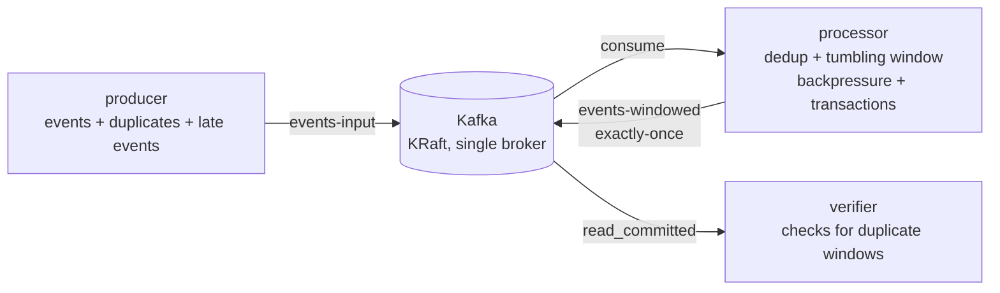

# C++ Event Streaming Pipeline — Windowing, Backpressure, Dedup & Exactly-Once

A **minimal, self-contained** C++ stream-processing example built on
[librdkafka](https://github.com/confluentinc/librdkafka) that demonstrates the
four concerns you normally reach for Kafka Streams (Java) or Apache Flink to get:

| Concern | How it is demonstrated |
| --- | --- |
| **Windowing** | Tumbling **event-time** windows aggregate `count`, `sum` and `avg` per key. |
| **Deduplication** | Repeated event ids are dropped using bounded per-window state. |
| **Backpressure** | An ingestion thread feeds a bounded queue; when the processing thread falls behind, the consumer is **paused** and later **resumed**. |
| **Exactly-once (EOS)** | Each flush emits window results **and** commits source offsets inside a single **Kafka transaction**, so output and progress advance atomically. |

Kafka Streams and Flink are JVM-only, so the "equivalent" here is a hand-rolled
[consume → process → produce](https://kafka.apache.org/documentation/#semantics)
loop using librdkafka's transactional producer API (`init_transactions`,
`begin_transaction`, `send_offsets_to_transaction`, `commit_transaction`) — the
exact primitives Kafka Streams uses under the hood for exactly-once processing.

## Architecture



Three tiny C++ programs, one shared image:

- **`producer`** — generates a finite event stream, deliberately injecting
  duplicate ids (~15%) and out-of-order/late events (~10%).
- **`processor`** — the heart of the demo. Two threads:
  - an **ingestion thread** that consumes into a bounded queue and pauses the
    consumer when the queue fills (backpressure);
  - a **processing thread** that deduplicates, updates event-time windows, and
    every interval emits closed windows while committing the source offsets in
    one transaction (exactly-once).
- **`verifier`** — reads the output topic with `isolation.level=read_committed`
  (so only committed transactions are visible) and flags any duplicate
  `(key, window_start)` — which must never appear when EOS holds.

## Data formats

- Input topic `events-input`, CSV: `event_id,key,event_ts_ms,value`
- Output topic `events-windowed`, CSV: `key,window_start_ms,window_end_ms,count,sum,avg`

## Prerequisites

- [Docker](https://www.docker.com/) and Docker Compose v2

That's it — the C++ toolchain and librdkafka are installed inside the build
image, so nothing is needed on the host.

## Run it

```bash
docker compose up --build
```

Compose starts, in order:

1. `kafka` — a single-node broker in **KRaft mode** (no ZooKeeper), tuned for
   single-broker transactions.
2. `topic-init` — creates `events-input` and `events-windowed`, then exits.
3. `processor`, `verifier`, `producer` — the pipeline.

Watch the logs; the producer exits after sending its batch while the processor
and verifier keep running. Stop and clean up with:

```bash
docker compose down -v
```

## What you should see

**Producer** finishes with a summary:

```
[producer] done. records sent=346 (including 46 duplicates)
```

**Processor** shows backpressure engaging/releasing, and transactional commits
that report exactly-once accounting (`dupes_dropped` matches the injected
duplicates, `late_dropped` counts events past the allowed lateness):

```
[processor] PAUSE consumption (backpressure, queue=120)
[processor] RESUME consumption (queue drained to 0)
[processor] committed txn: emitted 9 window(s), total_windows=15, dupes_dropped=29, late_dropped=0
[processor] source drained, closing remaining windows
[processor] committed txn: emitted 3 window(s), total_windows=24, dupes_dropped=46, late_dropped=0
```

**Verifier** prints each window result and confirms **no duplicate windows**:

```
[verifier] window 24: sensor-b,1790508680000,1790508682000,11,306.693,27.8812
[verifier] totals: results=24 duplicate_windows=0
```

### Proving exactly-once end-to-end

With the default settings the producer emits **300 unique events** (+46
duplicates). After the run, the sum of `count` across every committed window
equals exactly **300** — no event lost, none double-counted:

```bash
docker compose logs verifier | grep -oE 'sensor-[abc],[0-9]+,[0-9]+,[0-9]+' \
  | awk -F, '{s+=$4} END{print "total events across windows:", s}'
# total events across windows: 300

docker compose logs verifier | grep -c DUPLICATE   # -> 0
```

`46 duplicates dropped` + `0 duplicate window outputs` + `sum == 300 unique
events` together demonstrate deduplication and exactly-once semantics working
end to end.

## How each concept is implemented

### Windowing (event-time, tumbling)
Each event carries its own `event_ts_ms`. A window is `[floor(ts/W)*W, +W)`.
Aggregates live in per-`(key, window_start)` state. A **watermark**
(`max_event_time − allowed_lateness`) advances as events are processed; a window
is emitted once the watermark passes its end. Events arriving after their window
has closed are counted as `late_dropped`.

### Deduplication
A bounded `seen_ids` set rejects repeated event ids. Ids are indexed by their
window so that when a window closes its ids are evicted — keeping dedup state
bounded rather than growing forever.

### Backpressure
Ingestion and processing run on separate threads with a bounded queue between
them. When the queue reaches the high-water mark the consumer's partitions are
**paused** (`MAX_BUFFERED`); once processing drains it below the low-water mark
they are **resumed** (`RESUME_BUFFERED`). Splitting the threads is what lets
backpressure and event-time windowing coexist: pausing stops *new* reads, but
the processing thread keeps draining buffered events, so the watermark still
advances and windows close exactly once instead of being flushed while
incomplete. (`PROCESS_COST_MS` simulates a slow/heavy sink so the effect is
visible.)

### Exactly-once semantics
The processor's producer has a `transactional.id` (which also enables
idempotence). Every flush:

1. `begin_transaction()`
2. `produce()` the closed window results
3. `send_offsets_to_transaction()` — the source offsets consumed so far
4. `commit_transaction()`

Emitting output and advancing the input offsets in the **same** transaction is
what makes the pipeline exactly-once: on a crash the whole transaction is rolled
back and reprocessed, so results are never partially written or duplicated. The
verifier reads with `read_committed`, so it only ever sees committed output.

> **Single input partition.** The input topic uses one partition so the global
> event-time order is preserved for a minimal watermark. A multi-partition input
> would need per-partition watermark tracking (take the minimum across
> partitions), which is intentionally left out to keep the example small.

## Configuration

All knobs are environment variables (see `docker-compose.yml`).

**Producer**

| Variable | Default | Meaning |
| --- | --- | --- |
| `NUM_EVENTS` | `300` | Number of unique events to emit |
| `DUP_PERCENT` | `15` | Probability of resending an event (duplicate) |
| `LATE_PERCENT` | `10` | Probability of an out-of-order timestamp |
| `EVENT_INTERVAL_MS` | `50` | Event-time step between events |
| `PRODUCE_DELAY_MS` | `0` | Real-time pacing between events |

**Processor**

| Variable | Default | Meaning |
| --- | --- | --- |
| `WINDOW_MS` | `2000` | Tumbling window size |
| `ALLOWED_LATENESS_MS` | `1000` | Grace period before a window closes |
| `COMMIT_INTERVAL_MS` | `1000` | Transaction / commit cadence |
| `MAX_BUFFERED` | `120` | Queue high-water mark → pause consumption |
| `RESUME_BUFFERED` | `40` | Queue low-water mark → resume consumption |
| `IDLE_FLUSH_MS` | `4000` | Idle gap treated as end-of-stream (final flush) |
| `PROCESS_COST_MS` | `8` | Simulated per-event processing cost |

## Building without Docker (optional)

The image installs `librdkafka-dev` and builds with CMake + pkg-config:

```bash
sudo apt-get install -y build-essential cmake pkg-config librdkafka-dev
cmake -S . -B build -DCMAKE_BUILD_TYPE=Release
cmake --build build -j
# binaries: build/producer, build/processor, build/verifier
# point them at a broker via BROKERS=localhost:9092
```

## Project layout

```
.
├── docker-compose.yml   # Kafka (KRaft) + topic init + 3 app services
├── Dockerfile           # builds all three C++ binaries, slim runtime image
├── CMakeLists.txt       # librdkafka++ via pkg-config
└── src/
    ├── common.hpp       # config/env, CSV codec, logging, delivery reports
    ├── producer.cpp     # event generator (with duplicates + late events)
    ├── processor.cpp    # dedup + windowing + backpressure + transactions
    └── verifier.cpp     # read_committed consumer, duplicate-window check
```
