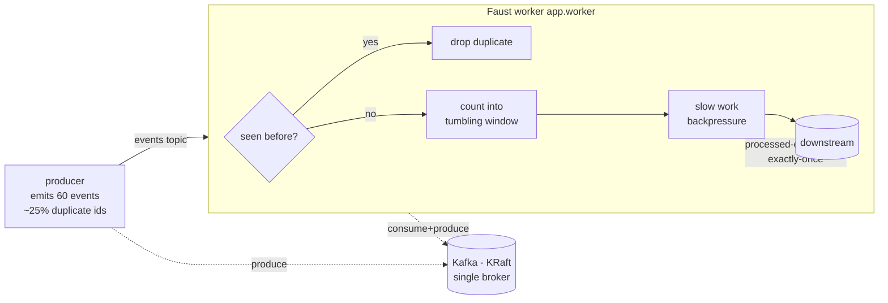

# Event Streaming Pipeline — Windowing, Backpressure, Dedup & Exactly‑Once

A minimal, fully working example of stream processing in **Python** using
[**Faust**](https://faust-streaming.github.io/faust/) (the Python equivalent of
**Kafka Streams** / a Flink‑style stream processor) on top of **Apache Kafka**.

Everything runs with a single `docker compose up`. The demo shows four core
stream‑processing concerns on one topic:

| Concern | How it is demonstrated |
| --- | --- |
| **Windowing** | A tumbling time window counts unique events per bucket (`window_count` grows, then resets when the window rolls). |
| **Backpressure** | A bounded in‑memory stream buffer + deliberately slow processing → Faust pauses fetching instead of growing memory without bound. |
| **Deduplication** | A Faust `Table` remembers event ids; repeated ids (injected by the producer) are dropped. |
| **Exactly‑once** | `processing_guarantee='exactly_once'`: consume → table updates → produce run in **one Kafka transaction**. |

## Architecture



* **`producer`** sends 60 JSON events to the `events` topic and deliberately
  re‑sends ~25% of previously used ids so the worker has real duplicates to drop.
* **`app` (Faust worker)** consumes `events`, deduplicates, counts into a tumbling
  window, simulates slow work (to exercise backpressure), and forwards each unique
  event to `processed-events` — all under an exactly‑once transaction.
* **`kafka`** is a single broker in **KRaft mode** (no ZooKeeper), tuned so a
  single node can serve transactions.
* **`init-topics`** is a one‑shot job that creates the `events` / `processed-events`
  topics *before* the worker starts (Faust only subscribes to external source
  topics that already exist at rebalance time).

## Project layout

```
stream-processing-pipeline/
├── docker-compose.yml     # Kafka (KRaft) + topic init + Faust worker + producer
├── Dockerfile             # image for the worker and producer
├── requirements.txt       # faust-streaming, confluent-kafka
├── app/
│   ├── worker.py          # Faust app: dedup + windowing + backpressure + EOS
│   └── producer.py        # event generator that injects duplicates
└── README.md
```

## Requirements

* Docker and Docker Compose v2 (`docker compose ...`).
* No local Python needed — everything runs in containers.

## Run it

```bash
docker compose up --build
```

Startup order is handled automatically:
`kafka (healthy)` → `init-topics` → `app` + `producer`.

Watch the worker output (in another terminal, or in the combined logs):

```bash
docker compose logs -f app
```

You will see lines like:

```
PROCESSED id=evt-0000 user=alice amount=287.23 window_count=1
PROCESSED id=evt-0018 user=dave  amount=190.00 window_count=15
DUPLICATE dropped id=evt-0046
REPORT received=60 processed=43 duplicates=17 current_window_count=0
```

* `window_count` climbs within each tumbling window and resets when the window rolls — **windowing**.
* `DUPLICATE dropped ...` — **deduplication**.
* `received == processed + duplicates` (e.g. `60 == 43 + 17`).

When you're done:

```bash
docker compose down -v
```

## Verifying the guarantees

After a run (before `down`), you can confirm exactly‑once end to end. The number
of messages written to `processed-events` equals the number of **unique** events
processed — duplicates are dropped and never forwarded:

```bash
# 60 events were produced
docker exec kafka /opt/kafka/bin/kafka-get-offsets.sh \
  --bootstrap-server localhost:9092 --topic events
# -> events:0:60

# only the unique ones are forwarded (consume+dedup+produce is atomic)
docker exec kafka /opt/kafka/bin/kafka-get-offsets.sh \
  --bootstrap-server localhost:9092 --topic processed-events
# -> processed-events:0:43     (matches "processed" in the REPORT line)
```

Inspect the deduplicated output stream directly:

```bash
docker exec kafka /opt/kafka/bin/kafka-console-consumer.sh \
  --bootstrap-server localhost:9092 --topic processed-events \
  --from-beginning --timeout-ms 5000
```

## How each feature works

### Windowing
```python
windowed_counts = (
    app.Table("windowed-counts", default=int, partitions=1)
    .tumbling(WINDOW_SIZE, expires=timedelta(minutes=5))
    .relative_to_now()
)
...
windowed_counts["events"] += 1          # counts into the current time bucket
```
A tumbling window buckets events by wall‑clock time. Old windows expire so state
doesn't grow forever — the same model Kafka Streams / Flink use.

### Deduplication
```python
seen_ids = app.Table("seen-ids", default=int, partitions=1)
...
if seen_ids[event.id]:
    continue                            # already processed -> drop
seen_ids[event.id] = 1
```
The `seen-ids` table is backed by a Kafka **changelog topic**, so dedup state
survives restarts and rebalances.

### Backpressure
```python
app = faust.App(..., stream_buffer_maxsize=BUFFER_MAXSIZE)   # bounded buffer
...
await asyncio.sleep(PROCESS_DELAY)      # slow consumer
```
With a fast producer, a small bounded buffer, and slow processing, Faust stops
fetching from Kafka until the worker catches up — memory stays bounded instead of
buffering the whole backlog.

### Exactly‑once
```python
app = faust.App(..., processing_guarantee="exactly_once")
...
windowed_counts["events"] += 1
await processed_topic.send(value=event) # produced in the SAME transaction
```
The source‑offset commit, the table (changelog) writes, and the output produce
are committed together in one Kafka transaction. On failure the whole unit rolls
back, so downstream sees each unique event **exactly once**.

## Configuration

Environment variables (set in `docker-compose.yml`):

| Service | Variable | Default | Meaning |
| --- | --- | --- | --- |
| app | `PROCESS_DELAY` | `0.25` | Per‑event work delay (drives backpressure). |
| app | `WINDOW_SIZE` | `10.0` | Tumbling window size, seconds. |
| app | `STREAM_BUFFER_MAXSIZE` | `8` | Bounded in‑memory buffer size. |
| producer | `NUM_EVENTS` | `60` | How many events to send. |
| producer | `DUP_RATE` | `0.25` | Fraction of sends that reuse a previous id. |
| producer | `PRODUCE_DELAY` | `0.05` | Delay between sends (fast vs. slow consumer). |
| producer | `STARTUP_DELAY` | `10` | Wait before producing (let the worker join the group). |

## Notes & gotchas

* **Single‑broker transactions.** The broker sets
  `transaction.state.log.replication.factor=1` and `min.isr=1` so exactly‑once
  works on one node. In production use ≥3 brokers.
* **Topics must pre‑exist.** Faust only subscribes to an external source topic
  that exists at rebalance time, which is why `init-topics` creates `events`
  before the worker starts.
* **Dependency versions.** This uses `faust-streaming==0.15.3` (requires Python
  ≥ 3.10). Older `faust-streaming` releases pin `aiokafka` loosely and can pull an
  incompatible `aiokafka` that crashes the transport driver.
